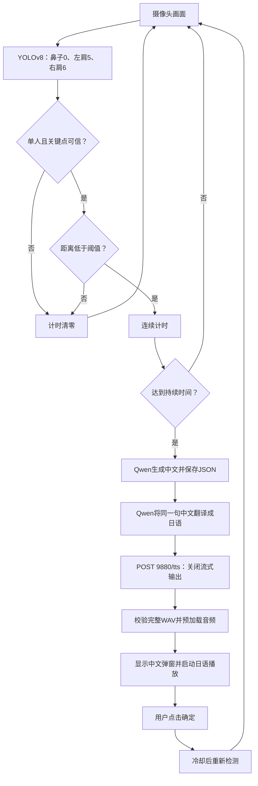

# 坐姿纠正机器人：YOLOv8 + Qwen7B + GPT-SoVITS

摄像头检测鼻子与双肩关键点，距离低于阈值并持续指定时间后，先生成并保存中文吐槽，再翻译成日语，发送给本地 GPT-SoVITS。完整音频准备好后，中文弹窗与日语播放一起触发，必须点击“确定”关闭。

这是对原单文件项目的模块化扩充，保留 `python posture_app.py` 启动方式。原脚本留在 `docs/legacy_posture_app.py.txt` 供对照，原有 ChatTTS YAML 配置保留但不参与新链路。

## 流程



## 项目结构

```text
posture_app.py                 启动入口
posture_robot/
  app.py                      摄像头、主界面、同步弹窗和播放
  core.py                     距离计算、连续计时、冷却
  services.py                 Qwen两次调用、SoVITS、历史保存
  config.py                   配置加载和基础校验
config/settings.example.json  可复制的配置模板
requirements.txt              检测、GUI与API后端依赖
requirements-local.txt        本地Qwen额外依赖
tests/                        不依赖GPU的逻辑与接口测试
docs/implementation.md        实现过程、设计取舍及验收步骤
runtime/history/              每次中文内容及生成状态（运行时生成）
runtime/app.log               轮转日志（运行时生成）
```

## 安装与运行（Windows PowerShell）

在项目根目录执行。建议为本项目创建 Python 3.11 环境；GPT-SoVITS 使用自己的环境，避免依赖冲突。

```powershell
py -3.11 -m venv .venv
.\.venv\Scripts\python.exe -m pip install --upgrade pip
```

先依据显卡驱动，在 [PyTorch 官方安装页](https://pytorch.org/get-started/locally/)选择 Windows / Pip / 对应 CUDA 并在这个虚拟环境里安装 PyTorch。不要直接复用原仓库中的 CUDA 版本锁定列表。然后安装本地 Qwen 所需依赖：

```powershell
.\.venv\Scripts\python.exe -m pip install -r requirements-local.txt
Copy-Item config/settings.example.json config/settings.json
```

编辑 `config/settings.json`：

1. `tts.ref_audio_path` 填写 GPT-SoVITS 所在机器上的参考音频绝对路径。Windows JSON 路径可以使用 `D:/GPT-SoVITS/ref_voice.wav`。
2. `tts.prompt_text` 填该音频实际说出的内容，`prompt_lang` 填该内容的语言，例如 `zh` 或 `ja`。它与生成目标语言 `ja` 是两个概念。
3. GPT-SoVITS 的模型权重需在服务端配置好，参考音频用于匹配已有音色。本项目不自动训练或切换音色权重。
4. 默认 Qwen 为 `Qwen/Qwen2.5-7B-Instruct`，支持本地权重目录。也可设回原来的 Coder 7B，但通用 Instruct 更贴合对话翻译任务。
5. 默认 YOLO 使用 CPU；有余量可将 `camera.device` 改为 `0`。Qwen 默认启用 CUDA 4-bit；没有 CUDA 时关闭 `load_in_4bit`，或者使用下述 API 模式。

在 GPT-SoVITS 自身目录和环境中，使用已经配置好的音色启动服务：

```powershell
python api_v2.py -a 127.0.0.1 -p 9880 -c GPT_SoVITS/configs/tts_infer.yaml
```

本项目针对官方 [api_v2.py](https://github.com/RVC-Boss/GPT-SoVITS/blob/main/api_v2.py) 的 `/tts` 接口；旧 `api.py` 的请求格式不兼容。不要用 WebUI 端口替代 API 端口。

先检查配置，再单独测试真实中文→日语→音频→弹窗链路：

```powershell
.\.venv\Scripts\python.exe posture_app.py --check-config
.\.venv\Scripts\python.exe posture_app.py --test-alert
.\.venv\Scripts\python.exe posture_app.py
```

首次运行可能下载模型。离线环境应提前下载权重并配置本地路径。`--check-config` 只检查配置结构；`--test-alert` 会实际调用模型和语音服务，不需要摄像头。

### 可选：使用已有 OpenAI 兼容 Qwen 服务

只安装 `requirements.txt` 即可，YOLO仍需要PyTorch。将 `qwen.backend` 改为 `openai`、`qwen.base_url` 改为服务的 `/v1` 地址、`qwen.model` 改为服务实际暴露的模型名称。如有鉴权，通过环境变量 `QWEN_API_KEY` 提供。仍然执行两次同步请求，不使用流式返回。`load_in_4bit` 只在 Transformers 后端生效。

## 调整检测参数

默认沿用原程序的垂直距离定义：`d = (左肩y + 右肩y) / 2 - 鼻子y`。当 `d < threshold` 连续达到 `duration` 秒触发。`120` 像素和 `5` 秒只是初始示例，并非所有人的通用标准。

| 配置 | 默认值 | 含义 |
|---|---:|---|
| posture.mode | pixels | 使用像素距离；normalized 表示除以肩宽 |
| posture.threshold | 120 | 低于此值判定异常 |
| posture.duration | 5 | 连续异常时间，秒 |
| posture.confidence | 0.5 | 鼻子、双肩均需达到的置信度 |
| posture.cooldown | 30 | 点击确定后等待时间，秒 |
| posture.max_gap | 1.5 | 两次有效检测间隔超过此值时重新计时 |
| runtime.retry_delay | 30 | 生成或播放失败后等待时间，秒 |

固定摄像头位置，先坐直观察距离，再弯腰观察距离，把阈值放在两者之间。若正常值约160、异常值约90，可从120开始调整。若切换 normalized 模式，必须同时换成比例阈值，例如0.55作为实验起点，不能沿用120。界面显示当前距离方便手动标定。

无人、多人或关键点缺失都会清零。持续异常在用户确认和冷却后会重新计满指定时间再提醒。检测速度慢于 `max_gap` 时计时会持续重置，应先提高检测速度或适当增加此参数。

## 同步与故障行为

所有推理、翻译和 TTS 请求严格串行，无后台生成线程。音频完全生成、校验并预加载后，在同一个 GUI 回调中显示弹窗并启动播放。操作系统窗口刷新和声卡缓冲会带来毫秒级差异，不承诺硬件级零延迟同步。音频输出设备内部持续播放是保持弹窗可点击所必需的，不存在“后台生成未完成就先弹窗”的路径。

生成期间摄像头及界面交互暂停，可能显示“未响应”；HTTP 请求受配置超时限制，Transformers 本地推理只受最大生成 token 数限制。弹窗期间也暂停检测。语音播完不会关闭弹窗，必须点确定；点确定会停止尚未播完的声音并进入冷却。

TTS失败时不弹出中文警告，也不偷偷改用其他音色。错误显示在主窗口并写入日志，延迟后重新检测。每次成功生成中文立即保存，即使后续翻译或语音失败也可追踪。摄像头故障会停止检测，保留窗口供退出。

## 测试与当前验证范围

```powershell
python -m unittest discover -s tests -v
python -m compileall -q posture_robot posture_app.py
```

已通过无需GPU的自动测试：连续计时、阈值边界、丢失与长间隔重置、冷却、关键点置信度、归一化、中文保存与串行顺序、TTS请求参数、错误WAV和失败记录。尚未在用户的摄像头、Qwen权重、声卡和已有GPT-SoVITS音色环境中完成真实端到端验收。依赖范围用于安装约束，不是已在目标GPU环境验证的完整锁文件。

详细实现和人工验收见 [实现文档](docs/implementation.md)。本项目使用二维姿态启发式提醒，无法仅凭鼻肩距离可靠区分所有坐姿变化。

## 官方接口参考

- [Ultralytics Pose：关键点结果接口](https://docs.ultralytics.com/tasks/pose/)
- [Qwen2.5-7B-Instruct：模型与Transformers示例](https://huggingface.co/Qwen/Qwen2.5-7B-Instruct)
- [GPT-SoVITS API v2：端点及语言字段](https://github.com/RVC-Boss/GPT-SoVITS/blob/main/api_v2.py)

